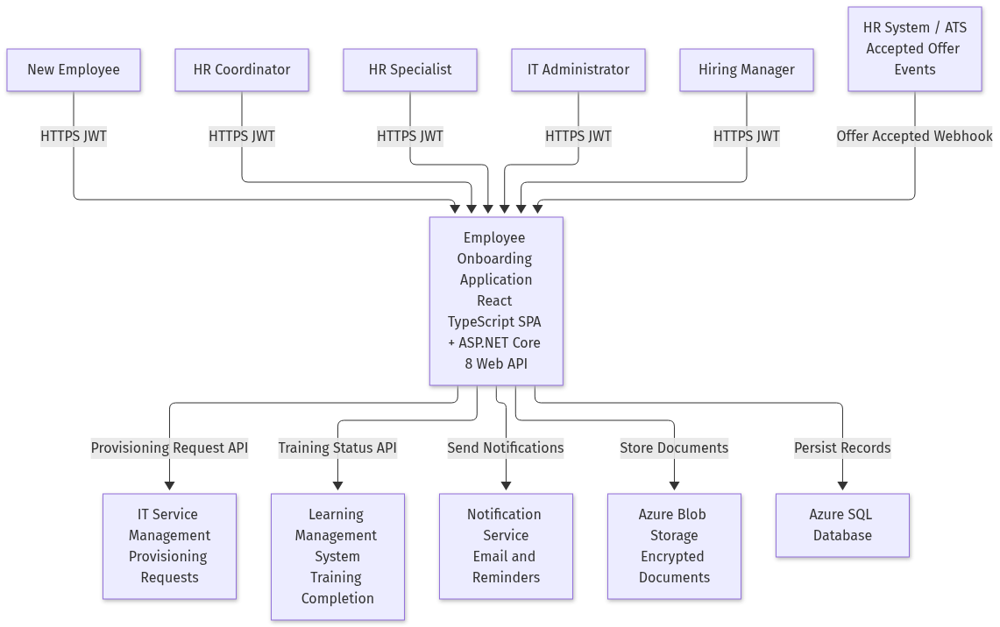
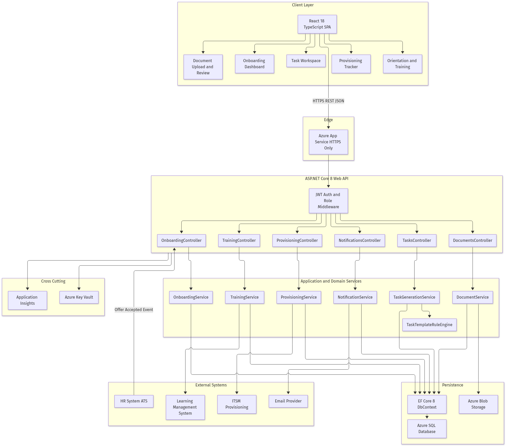
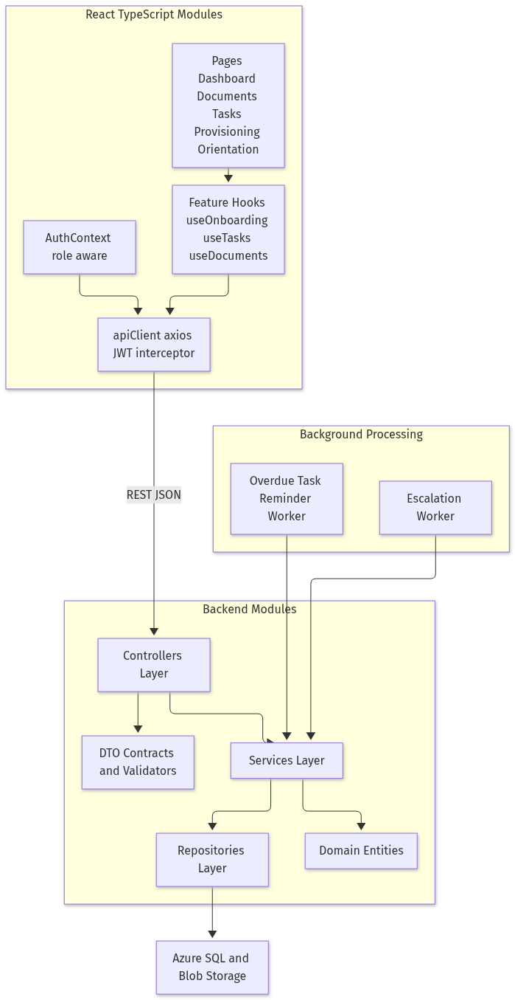
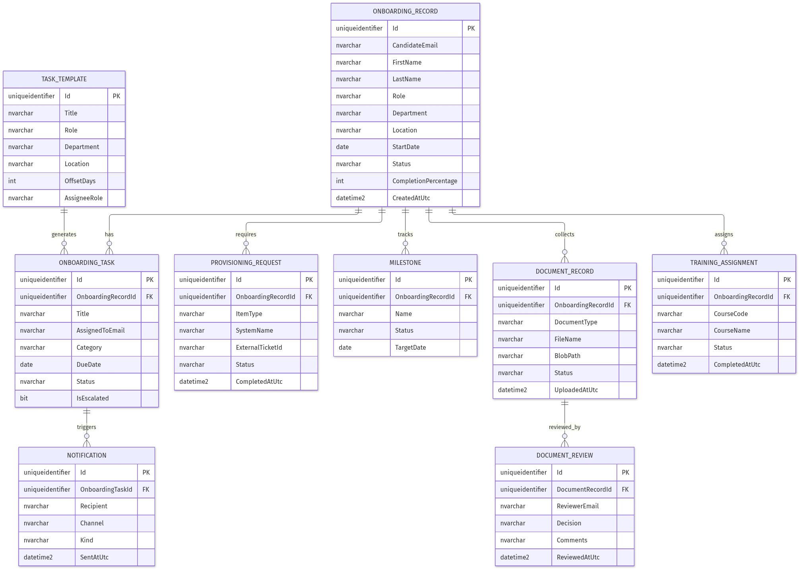
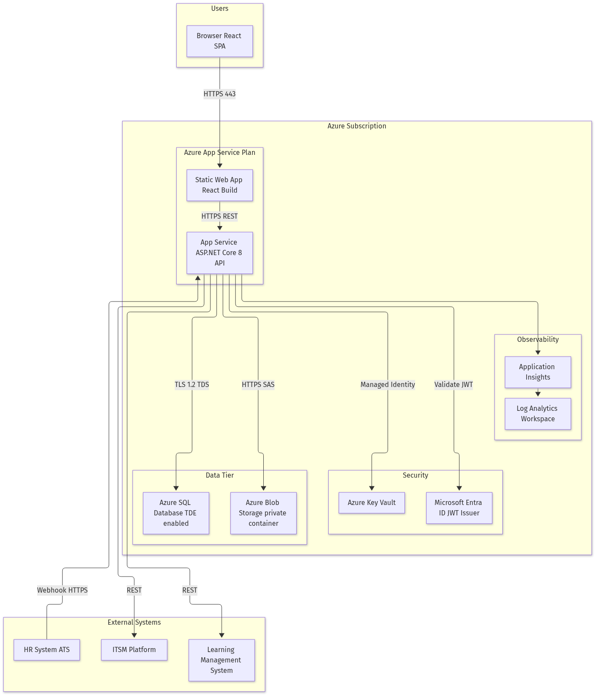
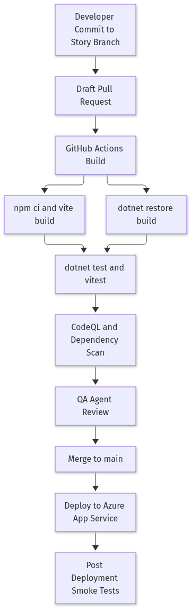

# High-Level Design - Employee Onboarding Application (Epic 2786)

## 1. Solution Overview

A centralized Employee Onboarding Application that automates pre-boarding, onboarding task management, document collection, approvals, IT provisioning, and employee orientation tracking. The solution is a React 18 + TypeScript SPA backed by an ASP.NET Core 8 Web API, persisting to Azure SQL Database (EF Core 8) and Azure Blob Storage for documents.

## 2. System Context and Actors

| Actor | Responsibility |
|---|---|
| New Employee | Uploads documents, completes tasks, orientation and training (US 2791, 2800, 2801) |
| HR Coordinator | Creates/monitors onboarding records, tracks progress and provisioning (US 2788, 2789, 2798) |
| HR Specialist | Reviews, approves or rejects submitted documents (US 2792) |
| IT Administrator | Fulfils provisioning requests for assets and accounts (US 2797) |
| HR System / ATS | Emits accepted-offer events that create onboarding records (US 2788) |
| ITSM Platform | Receives/updates provisioning requests (US 2797, 2798) |
| Learning Management System | Supplies training completion status (US 2801) |

## 3. Architecture Drivers

- Day-one readiness: all provisioning and tasks complete before start date.
- Compliance: secure, auditable document collection and approval.
- Automation: zero manual onboarding record entry; template-driven task generation.
- Visibility: real-time dashboard of status, milestones, overdue tasks, completion percentage.

## 4. Scope and Constraints

In scope: onboarding lifecycle, document compliance, task workflow automation, provisioning tracking, employee portal and orientation.
Out of scope: payroll, benefits enrolment, performance management.
Constraints: HTTPS only, JWT bearer authentication, role-based authorization, Azure-hosted.

## 5. Components and Responsibilities

| Component | Responsibility | Traces to |
|---|---|---|
| OnboardingController / OnboardingService | Create records from accepted offers, progress and milestone tracking | 2788, 2789 |
| DocumentsController / DocumentService | Secure upload to Blob Storage, review workflow, completion tracking | 2791, 2792 |
| TasksController / TaskGenerationService / TaskTemplateRuleEngine | Template-driven task generation by role, department, location; status updates | 2794 |
| NotificationsController / NotificationService + Reminder/Escalation workers | Notifications, reminders and escalations for overdue tasks | 2795, 2792 |
| ProvisioningController / ProvisioningService | Create and track asset/account provisioning requests | 2797, 2798 |
| TrainingController / TrainingService | Orientation and training assignment and completion recording | 2801 |
| Portal module (React) | Personalized, secure self-service onboarding portal | 2800 |

## 6. Frontend Design

React 18 + TypeScript + Vite. React Router routes: `/dashboard`, `/onboarding/:id`, `/documents`, `/tasks`, `/provisioning`, `/orientation`, `/portal`. Axios `apiClient` attaches the JWT bearer token; `AuthContext` exposes role-aware rendering. Feature hooks (`useOnboarding`, `useDocuments`, `useTasks`, `useProvisioning`, `useTraining`) encapsulate API access.

## 7. Backend and API Design

ASP.NET Core 8 Web API, controller -> service -> repository layering, DTO contracts with FluentValidation-style checks, global exception middleware, Swagger/OpenAPI.

| Method | Route | Purpose |
|---|---|---|
| POST | /api/onboarding/offer-accepted | Create onboarding record from ATS accepted-offer event (2788) |
| GET | /api/onboarding | List onboarding records with filters (2789) |
| GET | /api/onboarding/{id} | Record detail with milestones and completion percentage (2789) |
| GET | /api/onboarding/{id}/progress | Progress summary, overdue count, completion percentage (2789) |
| POST | /api/documents/upload | Upload a required document (2791) |
| GET | /api/documents/onboarding/{id} | Documents and completion status (2791) |
| POST | /api/documents/{id}/review | Approve or reject with comments, notify employee (2792) |
| POST | /api/tasks/generate/{onboardingId} | Generate tasks from templates by role/department/location (2794) |
| GET | /api/tasks | Tasks with filters, overdue flags (2794, 2795) |
| PUT | /api/tasks/{id}/status | Update task status (2794) |
| POST | /api/notifications/run-reminders | Trigger reminder and escalation sweep (2795) |
| POST | /api/provisioning/requests/{onboardingId} | Create provisioning requests for systems and equipment (2797) |
| GET | /api/provisioning/onboarding/{id} | Provisioning status visibility (2798) |
| PUT | /api/provisioning/{id}/status | External system status callback (2798) |
| GET | /api/training/onboarding/{id} | Training assignments and completion (2801) |
| PUT | /api/training/{id}/complete | Record training completion (2801) |
| GET | /api/portal/me | Personalized portal payload: tasks, documents, content (2800) |

## 8. Data and Persistence Design

Azure SQL Database with EF Core 8. Core entities: `OnboardingRecord`, `OnboardingTask`, `TaskTemplate`, `DocumentRecord`, `DocumentReview`, `ProvisioningRequest`, `TrainingAssignment`, `Milestone`, `Notification`. Documents are stored in a private Blob Storage container; only metadata and blob paths are stored in SQL.

## 9. Authentication and Authorization

JWT bearer tokens issued by Microsoft Entra ID. Roles: `Employee`, `HRCoordinator`, `HRSpecialist`, `ITAdmin`, `Manager`. Controllers enforce `[Authorize(Roles = ...)]`; employees can only access their own onboarding record.

## 10. Integration Design

- HR System / ATS -> HTTPS webhook `offer-accepted` (inbound).
- ITSM -> REST provisioning request creation and status callbacks.
- LMS -> REST training completion sync.
- Email provider -> notification and reminder delivery.

## 11. Security Architecture

HTTPS/TLS 1.2+ only, JWT validation, role checks, input validation, file type and size validation on upload, antivirus scan hook `[TBD]`, Azure Key Vault for secrets via managed identity, TDE on Azure SQL, private Blob container with short-lived SAS, full audit trail on document review and status changes.

## 12. Infrastructure and Deployment

Azure Static Web App (SPA) + Azure App Service (API) + Azure SQL + Blob Storage + Key Vault + Application Insights / Log Analytics.

## 13. CI/CD

GitHub Actions: build, test, scan on story branches and pull requests; deploy to Azure App Service after merge to `main`.

## 14. Observability

Application Insights request/dependency/exception telemetry, structured logging with correlation IDs, Log Analytics workspace, dashboards for overdue tasks and provisioning SLA.

## 15. Resiliency and Failure Handling

Retry with exponential backoff for ITSM/LMS/email calls, idempotent offer-accepted handling keyed by candidate email + start date, background workers resume from persisted state, global exception middleware returning RFC 7807 problem details.

## 16. Non-Functional Requirements

| NFR | Target |
|---|---|
| API latency (p95) | < 500 ms |
| Availability | 99.5% business hours |
| Document upload size | <= 10 MB per file |
| Concurrent users | 500 |
| Data retention | 7 years for compliance documents |
| Encryption | TLS in transit, AES-256 at rest |

## 17. Architecture Decisions

| ID | Decision | Rationale |
|---|---|---|
| AD-01 | React + TypeScript SPA | Baseline stack; strong typing for DTO contracts |
| AD-02 | ASP.NET Core 8 Web API | Baseline stack; mature auth and EF Core support |
| AD-03 | Blob Storage for documents, SQL for metadata | Cost-efficient, secure large-file handling |
| AD-04 | Template-driven rule engine for task generation | Satisfies role/location/department rule in US 2794 |
| AD-05 | Inbound webhook for accepted offers | Satisfies event-driven creation in US 2788 |

## 18. Assumptions and [TBD]

- Microsoft Entra ID is the identity provider. `[TBD]` tenant and app registration details.
- ITSM platform `[TBD]` (ServiceNow assumed API shape).
- LMS platform `[TBD]`.
- Email provider `[TBD]` (Azure Communication Services assumed).
- Antivirus scanning service for uploads `[TBD]`.

## 19. Traceability

| Feature | User Stories |
|---|---|
| 2787 Candidate-to-Employee Onboarding Management | 2788, 2789 |
| 2790 Document Collection and Compliance | 2791, 2792 |
| 2793 Task Assignment and Workflow Automation | 2794, 2795 |
| 2796 IT Provisioning and Access Management | 2797, 2798 |
| 2799 Employee Portal and Orientation | 2800, 2801 |
